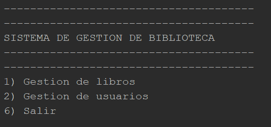

# Documentacion Técnica

**Alumno: Tobias Francisco Zamora Santos**
**Carnet: 202002873**
**Curso: Introduccion a los algoritmos y flujo de datos**
**Seccion: C**

## Descripción de la solución implementada

**Mi solucion:**

Tras leer detalladamente el enuciado determine que la mejor forma de trabajar el proyeto era en _**java**_.

## Diagrama de flujo del proceso principal

| Proceso          | Definicion                                                                            |
| ---------------- | ------------------------------------------------------------------------------------- |
| Menu             | Menu incial con mis opcion                                                            |
| RegsitrarUsuario | Funcion para registra en mi contralador de usuarios un nuevo objeto de tipo `Usuario` | 


## Manual de usuario con capturas o ejemplos

> DEBE INDICAR LA RUTA DE LA IMAGEN POR LO QUE LA IMAGEN DEBE SER ACCESIBLE

`DEBE INDICAR LA RUTA DE LA IMAGEN POR LO QUE LA IMAGEN DEBE SER ACCESIBLE`

    DEBE INDICAR LA RUTA DE LA IMAGEN POR LO QUE LA IMAGEN DEBE SER ACCESIBLE   

**Menu Inicial**



En este menu inial al usuario se le muestran todas las opciones generales dentro del programa.

**Opcion Gestion de Usuarios**


Se le muestra las opciones correspondientes para trabar con los usuario

**Opcion 1**


Cuando usted seleccione la opcion 1 entrara a la funcion para que pueda introducir los datos del nuevos usuario a registrar, acontinuacion se le muestra el proceso requerido:


Como puede observar debe ingresar el nombre, carnetm telefono y el email, una vez introduzca todos los datos solicitados y correctos el registro se completa mostrandole un mensaje de exito en el registro.


## Explicación de las estructuras de datos utilizadas

**Metodo Registrar ubicado en mi controlador de Usuario**

```java
public void Registrar() {
        System.out.println("--------REGISTRO DE DATOS PARA USUARIO--------");
        System.out.println("Ingrese su nombre");
        String nombre = l.nextLine();
        System.out.println("Ingrese su carnet");
        int carnet = l.nextInt();
        System.out.println("Ingrese su telefono");
        int telefono = l.nextInt();
        l.nextLine();
        System.out.println("Ingrese su email");
        String email = l.nextLine();

        for (int i = 0; i < usuarios.length; i++) {
            if (usuarios[i] == null) {
                usuarios[i] = new Usuario(id_actual, nombre, carnet, telefono, email);
                break;
            }
        }
        id_actual++;
        System.out.println("!!!-- USUARIO REGISTRADO CORRECTAMENTE --!!!");
}
```

Con este metodo yo puedo tomar los datos por consola de un nuevo usuario y cuando termine de capturar todos los datos poder crear un nuevo objeto de tipo `Usuario` e insertalo en mi lista de _usuarios_.

## Casos de prueba realizados y resultados obtenidos
## Limitaciones conocidas del sistema

- Error al importa la libreria `Scanner`
    
    Tuve el inconeveniente de que me falto importa la libreri de Scanner

* Error al implementar mi controlador 
+ Problema al contruir mi objeto de libro

1. Error al importa la libreria `Scanner`
2. Error al implementar mi controlador 
3. Problema al contruir mi objeto de libro