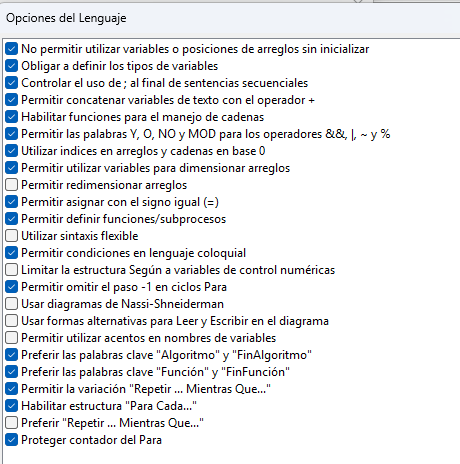

# LABORATORIO DE INTRODUCCION A LOS ALGORIMTOS Y FLUJO DE DATOS C

Ejemplos realizados en clase

## Índice

- [Configuración recomendada para el software PSeint](#configuracion-recomendada-para-el-software)
- [Sistema de inventario en PSeInt](#sistema-de-inventario-en-pseint)
- [Base para el proyecto 2](#base-para-el-proyecto-2)

---
## Configuracion recomendada para el software



---
## Sistema de inventario en PSeInt


La carpeta que contiene los archivos utilizados es: **[Inventario PSeInt](./Inventario%20PSeInt)** 

<!-- `ss` -->

### Enunciado
Desarrollar un programa interactivo que permita al usuario gestionar un pequeño inventario de productos, brindando opciones para agregar, consultar, modificar, eliminar y listar productos, con control de cantidad en existencia y precio. El sistema debe mostrar un menú, validar datos y repetir el proceso hasta que el usuario decida salir.

### Requirimientos

1. Crear un menú interactivo y repetitivo  

```pseudocodigo
Repetir
    Escribir "--- MENÚ ---"
    Escribir "1) Agregar un producto"
    Escribir "2) Consultar producto por código"
    Escribir "3) Modificar un producto"
    Escribir "4) Listar todos los productos"
    Escribir "5) Calcular inventario"
    Escribir "6) Salir"
    Leer eleccion

    Segun eleccion Hacer
        1:
            Escribir "OPCIÓN DE AGREGAR"
        2:
            Escribir "CONSULTAR POR CÓDIGO"
        3:
            Escribir "MODIFICAR UN PRODUCTO"
        4:
            Escribir "LISTAR TODOS LOS PRODUCTOS"
        5:
            Escribir "CALCULAR INVENTARIO"
        6:
            Escribir "¡¡ ADIÓS !!"
        De Otro Modo:
            Escribir "¡¡ OPCIÓN NO VÁLIDA !!"
    Fin Segun
Hasta Que eleccion == 6
```
**¿Cómo funciona?**
**`Repetir...Hasta Que`**: Crea un ciclo que seguirá mostrando el menú hasta que el usuario seleccione la opción 6 (Salir).

**`Escribir`**: Muestra en pantalla las opciones del menú.

**`Leer eleccion`**: Captura la opción que el usuario elige.

**`Segun eleccion Hacer`**: Evalúa el valor ingresado por el usuario y ejecuta la acción correspondiente.

**`De Otro Modo`**: Si el usuario ingresa un número fuera del rango 1-6, se muestra un mensaje indicando que la opción no es válida.

**`Fin Segun`**: Cierra la estructura de selección múltiple.

**`Hasta Que eleccion`** == 6: Termina el ciclo solo cuando la elección es 6.

2. Agregar un nuevo producto al inventario  
3. Consultar la información de un producto según una característica específica  
4. Modificar los datos de un producto existente  
5. Mostrar todos los productos almacenados  
6. Salir del menú, terminando el algoritmo

--- 

## Base para el proyecto 2

La carpeta que contiene los archivos utilizados es: **[Proyecto2](./Proyecto2)** 

Archivo main/entrada de ejecucion del proyecto: **[Proyecto2.java](./Proyecto2/src/main/java/main/Main/Proyecto2.java)** 

### Estructura con la que se trabajo
- Main
- Modelos
- Controladores


### Ubicación y estructura de `Proyecto2.java`
```java
package main.Main;

import Controladores.ControladorUsuario;
import java.util.Scanner;
```

**Explicación**

- `package main.Main;`
Indica la ubicación del archivo dentro del paquete main.Main, ayudando a organizar el proyecto.

- `import Controladores.ControladorUsuario;`
Importa la clase ControladorUsuario, la cual contiene los métodos para administrar los usuarios (registrar, modificar, listar, etc.).

- `import java.util.Scanner;`
Permite leer entradas del usuario desde la consola.


### Clase Principal


```java
public class Proyecto2 {

    public static ControladorUsuario usuarios = new ControladorUsuario();

```

**Explicación**

- `public class Proyecto2`
Define la clase principal del programa.

- `public static ControladorUsuario usuarios`
Crea un objeto estático usuarios del tipo ControladorUsuario para poder acceder a sus métodos sin instanciar varias veces la clase.

### Método Principal `main`

**Explicación**

- `salir`: variable booleana que controla si el ciclo del menú continúa o se detiene.

- `Scanner leer`: permite leer la opción ingresada por el usuario.

- `opcion`: almacena el número de la opción seleccionada.

### Menú Principal

```java
while (salir) {
    System.out.println("--------------------------------------");
    System.out.println("SISTEMA DE GESTION DE BIBLIOTECA");
    System.out.println("1) Gestion de libros");
    System.out.println("2) Gestion de usuarios");
    System.out.println("6) Salir");
    opcion = leer.nextInt();
```
Este bucle while se mantiene activo mientras la variable salir sea verdadera.
Cada iteración muestra el menú principal con las opciones disponibles:

- Gestión de libros

- Gestión de usuarios

- Salir del sistema

### Estructura del `switch` Principal

```java
switch (opcion) {
    case 1:
        break;
    case 2:
        menuUsuario();
        break;
    case 6:
        System.out.println("NOS VEMOS!!!!!!");
        salir = false;
        break;
    default:
        System.out.println("Opcion no valida");
        break;
}
```

**Explicación de cada caso**

- `case 1`: opción reservada para el módulo de libros (aún no implementado).

- `case 2`: llama al método menuUsuario() para mostrar el submenú de usuarios.

- `case 6`: imprime un mensaje de salida y finaliza el ciclo while.

- `default`: muestra un mensaje cuando se ingresa una opción no válida.


### Submenú de Gestión de Usuarios

```java
public static void menuUsuario() {
    Scanner leer = new Scanner(System.in);
    int opcion;
    System.out.println("--------------------------------------");
    System.out.println("MENU DE GESTION DE USUARIO");
    System.out.println("1) Registrar usuario");
    System.out.println("2) Consultar informacion de un usuario (especifico)");
    System.out.println("3) Modificar datos");
    System.out.println("4) Listar todos los usuarios");
    System.out.println("5) Salir");
    opcion = leer.nextInt();
```

Este método despliega el menú secundario para manejar usuarios del sistema.
Permite realizar las siguientes operaciones:

- Registrar nuevo usuario

- Consultar un usuario específico

- Modificar datos

- Listar todos los usuarios

- Salir al menú principal

### Lógica del Submenú de Usuarios

```java
switch(opcion){
    case 1:
        usuarios.Registrar();
        break;
    case 2:
        usuarios.ListarUsuario();
        break;
    case 3:
        usuarios.ModificarUsuario();
        break;
    case 4:
        usuarios.Listar();
        break;
    case 5:
        return;
    default:
        System.out.println("Opcion no valida");
        break;
}
```

**Explicación de los casos**

- `case 1` → `usuarios.Registrar();`
Llama al método encargado de registrar un nuevo usuario en el sistema.

- `case 2` → `usuarios.ListarUsuario();`
Permite consultar la información detallada de un usuario específico.

- `case 3` → `usuarios.ModificarUsuario();`
Ejecuta el método para modificar los datos de un usuario ya existente.

- `case 4` → `usuarios.Listar();`
Muestra una lista de todos los usuarios registrados en el sistema.

- `case 5` → `return;`
Sale del submenú y regresa al menú principal.

- `default`
Maneja cualquier opción no válida que el usuario introduzca.
---
